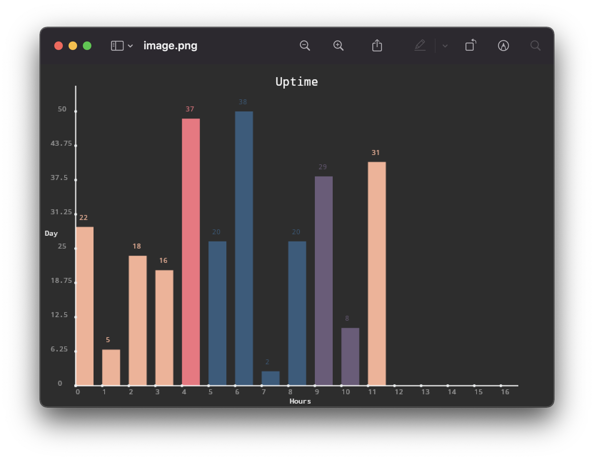

# Canvas-API Chart for Deno
A graph library for Deno. Inspired by [Chart.js](https://www.chartjs.org/). A simpler implementation for basic bar graphs that save to an image.

## 🚀 Use with Deno
```typescript
import Graph, { Vector2D } from 'https://deno.land/x/deno_chart/mod.ts';

const graph = new Graph({
  titleText: 'Uptime',
  xAxisText: 'Hours',
  yAxisText: 'Day',
  
  yMax: 50,
  bar_width: 25,
  graphSegments_X: 18,

  xTextColor: 'rgba(255,255,255,1)',
  xSegmentColor: 'rgba(255,255,255,0.5)',
  yTextColor: 'rgba(255,255,255,1)',
  ySegmentColor: 'rgba(255,255,255,0.5)',

  // Verbose Logging (Optional)
  verbose: true,
});

// Random Bar Generation with Colors!
const COLORS = [
  '#345C7D', '#F7B094', '#F5717F', '#F7B094',
  '#6C5B7A',
]

for (let i = 0; i < 12; i++) {
  const clr = COLORS[Math.floor(Math.random() * COLORS.length)];
  const y = Math.floor(Math.random() * 50);

  graph.add({
    position: new Vector2D(i, y),
    color: clr,
  });
}

// Draw to Canvas Context & Save png image
graph.draw();
graph.save('image.png');
```

## 🎆 Generated Image
<p align="center">
  
</p>

## 📙 License
Licensed under [MIT](LICENSE).